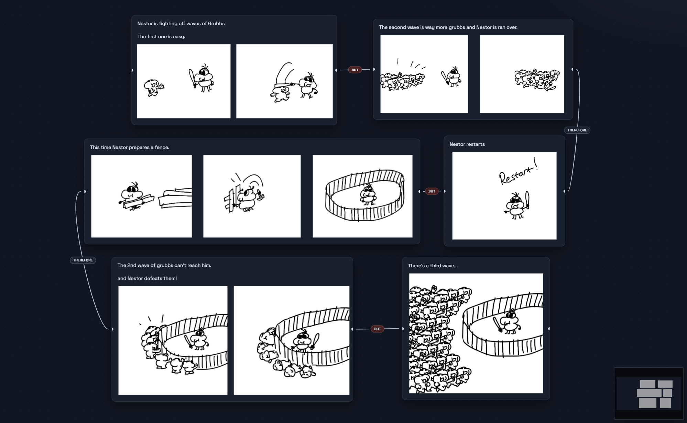

# ButTherefore

Storytelling software that helps you keep plots engaging using the power of `BUT` and `THEREFORE`.

Inspired by the writing advice from Matt Stone and Trey Parker, the app is built around cause-and-effect storytelling instead of flat "and then" scene chains. Each beat should either introduce a complication (`BUT`) or create a consequence (`THEREFORE`) so your story keeps moving with tension and momentum.

Watch the reference clip: [South Park creators' story advice (YouTube)](https://www.youtube.com/watch?v=vGUNqq3jVLg)



## What The App Does
- Infinite zoomable canvas for story structure.
- Beat nodes with editable text and visual connections.
- Clickable edge labels to switch between `BUT` and `THEREFORE`.
- Notes and image nodes for supporting context.
- Quick node creation by dragging from a connector onto empty canvas.
- Undo/redo across creation, editing, movement, resize, connect, and delete actions.
- Startup screen for new/open/recent projects and packaged-app update status.
- Autosave plus standard Save/Save As project files.

## Install (Windows)

### Option 1: Installer (Recommended)
1. Open the latest release page:  
   [https://github.com/Jejkobb/ButTherefore/releases/latest](https://github.com/Jejkobb/ButTherefore/releases/latest)
2. Download the file named like `ButTherefore-Setup-<version>.exe`.
3. Double-click the installer and follow the prompts.
4. Launch **ButTherefore** from Start Menu or desktop shortcut.

### Option 2: Portable ZIP (No Installation)
1. Download the portable ZIP:  
   [https://github.com/Jejkobb/ButTherefore/releases/latest/download/ButTherefore-Windows-Portable.zip](https://github.com/Jejkobb/ButTherefore/releases/latest/download/ButTherefore-Windows-Portable.zip)
2. Right-click the ZIP and choose **Extract All**.
3. Open the extracted `win-unpacked` folder.
4. Run `ButTherefore.exe`.

If a download link returns `404`, a release has not been published yet.

## Quick Start
1. Open the app and click **New Project**.
2. Double-click the canvas to create a beat node.
3. Drag between nodes to connect beats.
4. Click edge labels to switch between `BUT` and `THEREFORE`.
5. Add notes/images from the **Insert** menu.
6. Press `Ctrl + S` to save your project.

## Shortcuts
- `N`: Create a new story node at viewport center.
- `Shift + A`: Open Quick Create.
- `Home`: Frame all nodes.
- `Delete` / `Backspace`: Delete selected nodes/edges.
- `Ctrl/Cmd + Z`: Undo.
- `Ctrl/Cmd + Shift + Z`: Redo.
- `Ctrl/Cmd + S`: Save.
- `Ctrl/Cmd + O`: Open project.
- `Esc`: Close open menu/palette.

## Project Files
- Main project file: `*.storybeat.json`
- Assets folder: sibling directory named `<project-name>.assets/`
- Images are stored as files in the assets folder and referenced by relative path in JSON.
- Autosave file is stored in app data as `autosave/autosave.storybeat.json`.

## Run From Source (Developers)
```bash
npm install
npm run dev
```

Build production bundles:

```bash
npm run build
```

Build Windows installer locally:

```bash
npm run dist:win
```

Automated Windows release (bump version, commit/push, publish installer, upload portable ZIP):

```bash
npm run release:win:auto
```

Optional flags:

```bash
npm run release:win:auto -- -Bump minor
npm run release:win:auto -- -Version 0.2.0
```

Create/update the portable ZIP:

```bash
tar -a -cf release/ButTherefore-Windows-Portable.zip -C release win-unpacked
```

## Maintainer Release Note
Upload both of these files to each GitHub Release:
- `ButTherefore-Setup-<version>.exe`
- `ButTherefore-Windows-Portable.zip`

That keeps the direct ZIP link above working for one-click downloads.
